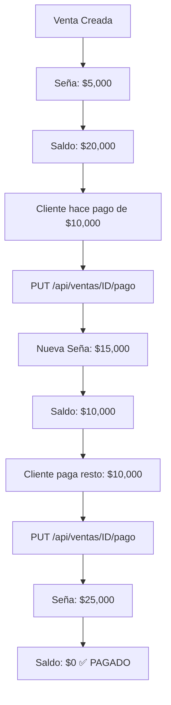

# 💳 Actualizar Pago de Venta - Documentación

## 🎯 Problema Resuelto

Cuando un cliente hace un pago adicional después de crear la venta, necesitas:
1. **Actualizar la seña** (monto total pagado hasta el momento)
2. **Agregar un comprobante** del nuevo pago
3. **Recalcular el saldo** automáticamente

---

## 🚀 Nuevo Endpoint

### `PUT /api/ventas/{id}/pago`

**Descripción:** Actualiza la seña y permite agregar/actualizar el comprobante de pago.

---

## 📝 Request

### Headers
```
Authorization: Bearer {token}
Content-Type: multipart/form-data
```

### Parameters

| Campo | Tipo | Requerido | Descripción |
|-------|------|-----------|-------------|
| `id` | path | ✅ Sí | ID de la venta |
| `sena` | formData number | ✅ Sí | Nueva seña (total acumulado) |
| `comprobante` | formData file | ❌ No | Comprobante del pago (PDF, JPG, PNG) |

---

## 📊 Ejemplo de Uso

### Escenario Completo

**1. Cliente compra productos por $25,000**
```bash
POST /api/ventas
{
  "cliente_id": 1,
  "precio_venta": 25000,
  "sena": 5000,  # Paga $5,000 de seña
  "detalles": [...]
}
```

**Resultado:**
- Precio de venta: $25,000
- Seña inicial: $5,000
- Saldo pendiente: $20,000

---

**2. Cliente hace un pago adicional de $10,000**
```bash
PUT /api/ventas/123/pago
Content-Type: multipart/form-data

sena: 15000  # Nueva seña total ($5,000 + $10,000)
comprobante: [archivo PDF/JPG]
```

**Resultado:**
- Precio de venta: $25,000
- Seña actualizada: $15,000
- Saldo pendiente: $10,000 ⬇️ (se redujo)

---

**3. Cliente paga el saldo restante**
```bash
PUT /api/ventas/123/pago
Content-Type: multipart/form-data

sena: 25000  # Paga completo
comprobante: [archivo PDF/JPG]
```

**Resultado:**
- Precio de venta: $25,000
- Seña actualizada: $25,000
- Saldo pendiente: $0 ✅ (PAGADO COMPLETO)

---

## 🧪 Testing con cURL

```bash
# 1. Login
curl -X POST http://localhost:8080/auth/login \
  -H "Content-Type: application/json" \
  -d '{"email":"demo@vartan.com","password":"demo1234"}'

# 2. Actualizar pago de venta
curl -X PUT http://localhost:8080/api/ventas/1/pago \
  -H "Authorization: Bearer {TOKEN}" \
  -F "sena=15000" \
  -F "comprobante=@/ruta/al/comprobante.pdf"
```

---

## 📤 Response

### Success (200 OK)
```json
{
  "message": "Pago actualizado exitosamente",
  "venta": {
    "id": 123,
    "cliente_id": 1,
    "precio_venta": 25000,
    "costo": 20000,
    "ganancia": 5000,
    "sena": 15000,
    "saldo": 10000,
    "descuento": 300,
    "total_final": 24700,
    "comprobante_url": "uploads/comprobantes/comprobante_pago_1234567890.pdf"
  },
  "saldo_actual": 10000
}
```

### Error - Seña mayor al precio de venta (400)
```json
{
  "error": "La seña no puede superar el precio de venta",
  "precio_venta": 25000,
  "sena_enviada": 30000
}
```

### Error - Venta no encontrada (404)
```json
{
  "error": "Venta no encontrada"
}
```

---

## 🎨 Implementación en Frontend

### 1. Interfaz TypeScript

```typescript
interface IUpdatePagoRequest {
  sena: number;
  comprobante?: File;
}

interface IUpdatePagoResponse {
  message: string;
  venta: IVenta;
  saldo_actual: number;
}
```

### 2. Servicio

```typescript
// En venta.service.ts
export const ventaService = {
  // ...otros métodos...
  
  updatePago: async (
    id: number, 
    sena: number, 
    comprobante?: File
  ): Promise<IUpdatePagoResponse> => {
    const formData = new FormData();
    formData.append('sena', sena.toString());
    
    if (comprobante) {
      formData.append('comprobante', comprobante);
    }
    
    const response = await api.put<IUpdatePagoResponse>(
      `/api/ventas/${id}/pago`, 
      formData
    );
    return response.data;
  },
};
```

### 3. Componente de Pago

```tsx
const PagoVentaModal = ({ venta, onSuccess }: Props) => {
  const [nuevaSena, setNuevaSena] = useState(0);
  const [comprobante, setComprobante] = useState<File | null>(null);
  
  const saldoPendiente = venta.precio_venta - (venta.sena || 0);
  
  const handleSubmit = async () => {
    try {
      // Validar que la nueva seña sea mayor a la actual
      const senaActual = venta.sena || 0;
      if (nuevaSena <= senaActual) {
        toast.error('La nueva seña debe ser mayor a la actual');
        return;
      }
      
      // Validar que no supere el precio de venta
      if (nuevaSena > venta.precio_venta) {
        toast.error('La seña no puede superar el precio de venta');
        return;
      }
      
      const result = await ventaService.updatePago(
        venta.id, 
        nuevaSena, 
        comprobante || undefined
      );
      
      toast.success(result.message);
      toast.info(`Saldo pendiente: $${result.saldo_actual}`);
      onSuccess(result.venta);
      
    } catch (error) {
      toast.error('Error al actualizar pago');
    }
  };
  
  return (
    <Dialog>
      <DialogContent>
        <DialogHeader>
          <DialogTitle>Registrar Pago</DialogTitle>
        </DialogHeader>
        
        <div className="space-y-4">
          {/* Info actual */}
          <div className="bg-muted p-4 rounded">
            <p>Precio de venta: ${venta.precio_venta}</p>
            <p>Seña actual: ${venta.sena || 0}</p>
            <p className="font-bold">Saldo pendiente: ${saldoPendiente}</p>
          </div>
          
          {/* Nueva seña */}
          <div>
            <Label>Nueva seña total</Label>
            <Input
              type="number"
              value={nuevaSena}
              onChange={(e) => setNuevaSena(Number(e.target.value))}
              placeholder={`Mínimo: ${(venta.sena || 0) + 1}`}
            />
            <p className="text-sm text-muted-foreground mt-1">
              Monto total pagado hasta ahora (incluyendo seña anterior)
            </p>
          </div>
          
          {/* Comprobante */}
          <div>
            <Label>Comprobante de pago (opcional)</Label>
            <Input
              type="file"
              accept=".pdf,.jpg,.jpeg,.png"
              onChange={(e) => setComprobante(e.target.files?.[0] || null)}
            />
          </div>
          
          {/* Cálculo */}
          {nuevaSena > 0 && (
            <div className="bg-green-50 p-4 rounded">
              <p className="font-bold">
                Nuevo saldo: ${venta.precio_venta - nuevaSena}
              </p>
            </div>
          )}
        </div>
        
        <DialogFooter>
          <Button onClick={handleSubmit}>Registrar Pago</Button>
        </DialogFooter>
      </DialogContent>
    </Dialog>
  );
};
```

---

## ✅ Validaciones del Backend

1. **Seña no puede superar precio de venta**
   ```
   sena <= precio_venta
   ```

2. **Archivo válido (si se envía)**
   - Extensiones: `.pdf`, `.jpg`, `.jpeg`, `.png`
   - Tamaño máximo: 5MB

3. **Recalcula automáticamente:**
   - `saldo = precio_venta - sena`
   - `descuento = saldo * 0.03` (si usa financiera)
   - `total_final = precio_venta - descuento`

---

## 🔄 Flujo Completo



---

## 📊 Diferencias con UPDATE normal

| Característica | PUT /api/ventas/{id} | PUT /api/ventas/{id}/pago |
|---------------|---------------------|--------------------------|
| **Propósito** | Modificar datos generales | Registrar pagos |
| **Campos** | Varios campos | Solo seña + comprobante |
| **Validaciones** | Básicas | Valida seña <= precio_venta |
| **Comprobante** | ❌ No maneja | ✅ Sí maneja |
| **Uso típico** | Corregir errores | Pagos del cliente |

---

## ⚠️ Consideraciones Importantes

1. **La seña es acumulativa**
   - NO envíes el monto del pago individual
   - Envía el TOTAL pagado hasta el momento
   
   ❌ Incorrecto:
   ```json
   { "sena": 10000 }  // Solo el pago nuevo
   ```
   
   ✅ Correcto:
   ```json
   { "sena": 15000 }  // Seña anterior + pago nuevo
   ```

2. **El comprobante reemplaza al anterior**
   - Si subes un nuevo comprobante, el anterior se elimina
   - Guarda los comprobantes anteriores en otro lado si necesitas historial

3. **No afecta el stock**
   - Solo actualiza montos de pago
   - El stock ya se descontó al crear la venta

---

## 📝 Ejemplos de Casos de Uso

### Caso 1: Pago en cuotas
```
Venta: $30,000
Cuota 1: $10,000 → PUT /pago con sena: 10000
Cuota 2: $10,000 → PUT /pago con sena: 20000
Cuota 3: $10,000 → PUT /pago con sena: 30000 ✅
```

### Caso 2: Seña + saldo en dos pagos
```
Venta: $25,000
Seña inicial: $5,000 (al crear venta)
Pago 1: $15,000 → PUT /pago con sena: 20000
Pago 2: $5,000  → PUT /pago con sena: 25000 ✅
```

### Caso 3: Modificar seña sin comprobante
```bash
curl -X PUT /api/ventas/1/pago \
  -F "sena=20000"
# No envía comprobante, solo actualiza monto
```

---

**Fecha:** 2026-02-13  
**Endpoint:** `PUT /api/ventas/{id}/pago`  
**Archivos modificados:**
- `controllers/sales.go`
- `routes/routes.go`

**Estado:** ✅ Backend completado y documentado
